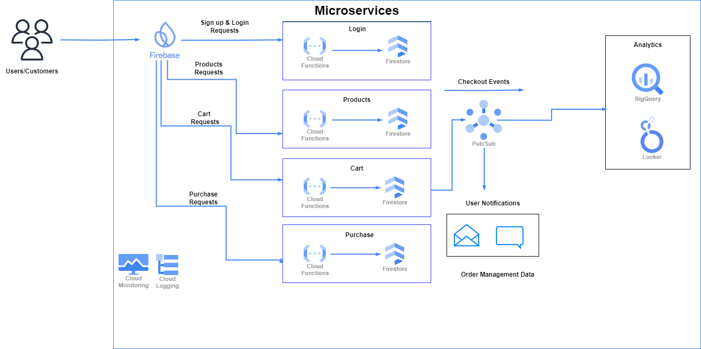

# Buffs E-commerce Platform

This project implements an API-first, event-driven architecture for an e-commerce platform using Google Cloud Platform (GCP) services. Designed for scalability, modularity, and seamless integration, it leverages serverless components and follows best practices of system design. 

---

## Team Members

1. Hariharan Kumar
2. Naveen Vinayaga Murthy

## Key Features

### User Interaction and Frontend Operations
- **User Actions**: Users interact with a website hosted on Firebase to explore products, add items to their cart, and proceed to checkout.
- **API Integration**: Various API requests are triggered for login, cart operations, and payments.

---

## Backend Microservices

Google Cloud Functions form the backbone of the backend services, ensuring modularity and scalability:

- **Login API Service**: Integrates with Firebase Authentication to manage user sign-ups and logins.
- **Cart API Service**: Handles cart operations like adding items, updating quantities, and finalizing carts.
- **Product API Service**: Fetches product details, pricing, and availability.
- **Purchase API Service**: Processes payments, reserves inventory, and manages order placement.
- **Process Cart Finalized Service**: Listens to the `cart-finalized` Pub/Sub topic, reserves products, and updates the database.
- **Process Payment Success Service**: Listens to the `payment-success` Pub/Sub topic, finalizes inventory updates, and notifies the user.
- **Process Payment Failed Service**: Listens to the `payment-failure` Pub/Sub topic, restores inventory, and notifies the user of payment failure.
- **Process Order Placed Service**: Listens to the `order-placed` Pub/Sub topic, adds order data to Firestore and BigQuery, and sends order confirmations.

---

## Event-Driven Workflow with Pub/Sub

- **Cart Finalization**: Triggers the `cart-finalized` event, initiating inventory updates, user notifications, and payment processing.
- **Payment Events**: Events like `payment-success` or `payment-failure` trigger inventory updates, transaction logging, and user notifications.

---

## Data Storage and Management

- **Firestore**: The centralized database, storing user, cart, product, and order data in structured documents.
  - **Users**: User details.
  - **Carts**: Cart information.
  - **Products**: Product inventory.
  - **Orders**: Order records.
- **Firebase Authentication**: Manages user login and authorization.

---

## Analytics and Reporting

- **BigQuery**: Real-time ingestion of order data for analytics.
- **Looker**: Dashboards for visualizing order data insights.

---

## Monitoring and Logging

- **Cloud Monitoring**: Tracks system health and sets alert policies for critical issues.
- **Cloud Logging**: Collects detailed logs for debugging and auditing.
- **Alerts**: Notifies admins when system metrics exceed thresholds.

---
## Architecture Diagram



## Deploying the Cloud Function

This guide provides step-by-step instructions for deploying a Cloud Function using Google Cloud CLI. Follow the steps below to deploy the `<cloud_function>` backend service.

---

### Prerequisites

1. **Install Google Cloud CLI**: Ensure that you have the `gcloud` CLI installed on your system. [Download and install it here](https://cloud.google.com/sdk/docs/install) if you haven’t already.
2. **Google Cloud Project**: Confirm you have access to the Google Cloud project named `buffs-e-commerce-platform`.
3. **Authentication**: Log in to your Google Cloud account using the following command:

```
gcloud auth login
gcloud config set project <project_id>
```

---

### Deployment Steps

1. **Navigate to the Backend Code Directory**:
   - Open a terminal and ensure you are in the directory containing the backend code for `<cloud_function>`.

    ```
     cd <path of the cloud function backend>
    ```

2. **Run the Deployment Command**:

    - Use the following command to deploy the function.

    ```bash
        gcloud functions deploy <cloud_function_name>\
    --runtime python310 \
    --trigger-http \
    --allow-unauthenticated \
    --project buffs-e-commerce-platform
    ```

## Frontend Deployment on Firebase

This guide provides step-by-step instructions to deploy and host the frontend of the Buffs E-Commerce platform using Firebase Hosting.

### Prerequisites

1. [Node.js](https://nodejs.org/) installed on your system (preferably the latest LTS version).
2. A [Firebase account](https://firebase.google.com/) with a Firebase project created.
3. Firebase CLI installed on your machine. If not installed, run the following command:
   ```bash
    npm install -g firebase-tools
   ```

### Deployment Steps

1. **Navigate to the Frontend Code Directory**:
   - Open a terminal and ensure you are in the directory containing the frontend code.

    ```bash
     cd <path of the frontend files>
    ```
2. **Install the necessary dependencies and build the Frontend**:

    ```bash
    npm install
    npm run build
    ``` 
3. **Host the Frontend on Firebase**:

    ```bash
    firebase login
    firebase init hosting
    ```
    - Select Firebase project: Choose the Firebase project created for Buffs E-Commerce.
    - Specify public directory: Enter the directory containing your built files (e.g., build or dist).
    - Single-page application: Respond with Yes to configure as a single-page app (rewrites all URLs to index.html).
    - Overwrite existing files: Select No unless you’re sure.

    **Deploy the frontend**

    ```
    firebase deploy
    ```

    After deployment, Firebase will provide a hosting URL. Visit the provided URL to see your deployed frontend.


## Conclusion

This project exemplifies a modern, scalable, and robust e-commerce solution using GCP services, delivering high reliability and performance while maintaining ease of integration and operational efficiency.